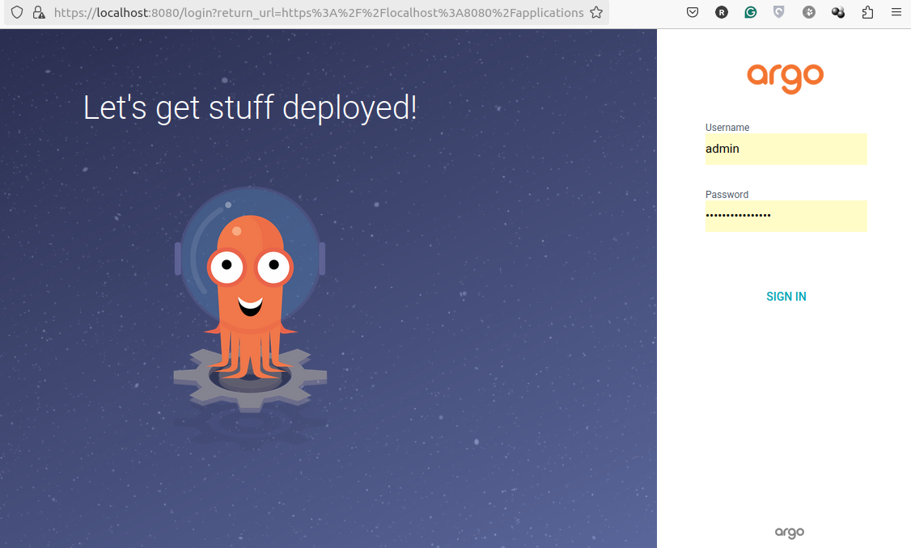

# Start work with Argo CD
https://argo-cd.readthedocs.io/en/stable/
```
k3d cluster create argo
k create namespace argocd
k get ns
kubectl apply -n argocd -f https://raw.githubusercontent.com/argoproj/argo-cd/stable/manifests/install.yaml
k get all -n argocd
k get po -n argocd -w
```
## Port Forwarding
```
kubectl port-forward svc/argocd-server -n argocd 8080:443
Forwarding from 127.0.0.1:8080 -> 8080
```
## Argo CD web interface
The API server can then be accessed using https://localhost:8080 (!note: httpS, you will need to accept a license in the browser). It requires to login with login and password. Argo CD gives you the default login `admin` and some random password. You can get this password with command:
```
k -n argocd get secret argocd-initial-admin-secret -o jsonpath="{.data.password}" | base64 -d; echo
```

